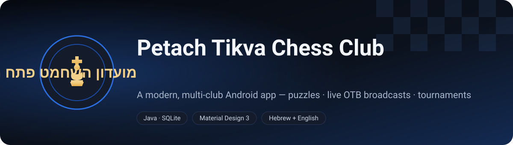
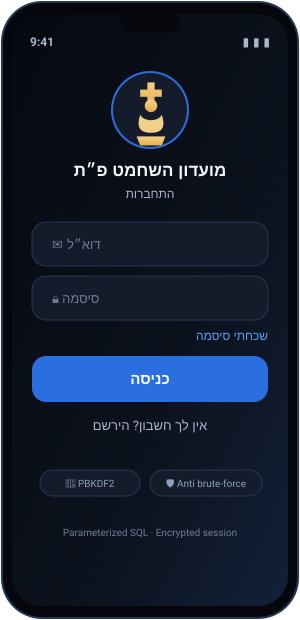
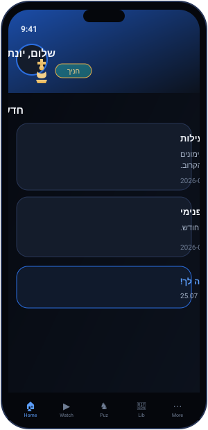
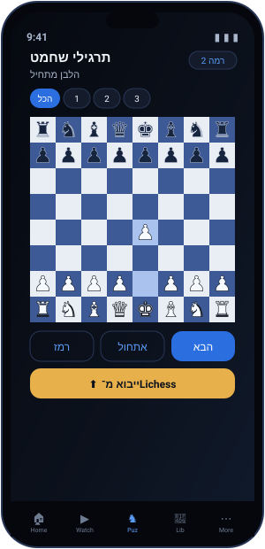
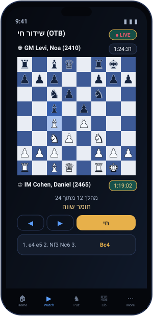
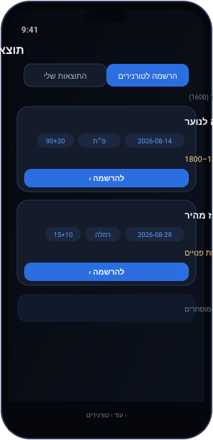
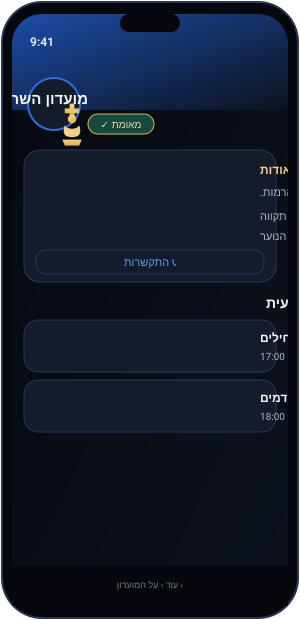

<p align="center">
  
</p>

<p align="center">
  
  
  
  
  
  
</p>

<p align="center">
  <b>מועדון השחמט פתח תקווה</b> — a modern, multi-club Android app for chess clubs:<br>
  role-based access, an interactive puzzle trainer wired to <b>Lichess</b>, live <b>OTB broadcasts</b>,
  rating-filtered federation tournaments, a club library, homework, and an admin center.<br>
  Hebrew by default (full RTL) with a one-tap switch to English.
</p>

---

## 📱 Screens

<table align="center">
  <tr>
    <td align="center"><br><sub><b>Secure login</b></sub></td>
    <td align="center"><br><sub><b>Home &amp; news</b></sub></td>
    <td align="center"><br><sub><b>Puzzles (Lichess)</b></sub></td>
  </tr>
  <tr>
    <td align="center"><br><sub><b>Watch — OTB broadcasts</b></sub></td>
    <td align="center"><br><sub><b>Tournaments by rating</b></sub></td>
    <td align="center"><br><sub><b>Club profile</b></sub></td>
  </tr>
</table>

> The images above are design mockups rendered in the app's real theme. Build the project in
> Android Studio to run it on a device/emulator.

---

## ✨ Features

### ♟ Chess trainer
- Interactive board (tap-to-move) with **legal-move dots**, last-move and **king-in-check** highlights.
- Puzzles load **live from the Lichess API** and are grouped by **difficulty levels** (filter chips).
- Staff can also import puzzles from a **PGN file** or add one manually (validated by the engine).

### 📺 Watch — live OTB broadcasts
- Streams official **Lichess Broadcasts** (relays of over-the-board events).
- Pick a tournament → round → **game**, then follow it live with **move navigation**, **player titles + Elo**,
  **clocks**, a highlighted **move list**, **captured material**, and a 6-second **auto-refresh**.
- For now, only **elite games (both players 2400+)** are shown.

### 🎮 Progress &amp; gamification
- Students earn **XP** for solving puzzles, finishing assignments and playing tournaments, and level up
  as they go — with a **daily streak** and unlockable **badges** (puzzle/assignment/tournament/streak milestones).
- Admins get a **club analytics** dashboard: members, active-this-week, puzzles solved, assignments done,
  tournaments played, and an **XP leaderboard**.
- All of it is derived by `Gamification` — a pure, unit-tested engine over an append-only activity log
  (Firestore when configured, SQLite otherwise).

### 🏆 Tournaments
- **My results** (imported by staff from a CSV) and **Register** — real **federation tournaments** for the
  current month, showing **only the ones the player is eligible for by rating** (ineligible ones are hidden),
  with date, location, time control, rating requirement, organizer, places and a registration link.

### 👥 Clubs (multi-tenant)
- On registration you **join an existing club** or **create your own** and become its admin/owner.
- Every club has a **profile**: logo, banner, about, address, playing hall, contact, and a **weekly schedule**
  generated from its real groups.
- A public **staff directory** (coaches, tutors, admins) everyone can browse.

### 🎓 Roles &amp; people
- Four roles — **Admin · Tutor · Parent · Student** — with role-based navigation and data access.
- **Semi-automatic approval**: a student whose name matches an imported club-roster player is approved
  automatically and adopts that player's rating.
- Parents link children (verified by the child's own credentials), see their info, and contact staff by phone/WhatsApp.
- Library (categorized PDFs), homework/assignments with attachments and a home-screen reminder, club news.

### 🔐 Security
- Salted **PBKDF2-HMAC-SHA256** password hashing (constant-time compare).
- **Parameterized SQL everywhere** — injection is structurally impossible.
- **Brute-force lockout** (escalating), **encrypted session** (Android Keystore), input validation,
  cleartext-HTTP blocked, R8 hardening, no email enumeration.

---

## 🚀 Getting started

1. Open the project in **Android Studio** (Giraffe or newer) and let Gradle sync.
2. Run on a device/emulator with **Android 8.0 (API 26)** or newer.

```bash
./gradlew assembleDebug
```

### Demo accounts (change before publishing)

| Role            | Email                   | Password      |
|-----------------|-------------------------|---------------|
| **Super admin** | `noamslutski@gmail.com` | `Noam#2026`   |
| Club admin      | `admin@ptchess.co.il`   | `Admin#2026`  |
| Tutor           | `tutor@ptchess.co.il`   | `Tutor#2026`  |
| Student         | `child@ptchess.co.il`   | `Child#2026`  |
| Parent          | `parent@ptchess.co.il`  | `Parent#2026` |

The app ships with **no placeholder content** — the club, accounts and groups are the working skeleton;
puzzles come from Lichess and everything else (news, library, tournaments, roster) is filled by real use.

### API keys

Lichess endpoints need no key. The federation **players** and **tournaments** features use the parse.bot API,
whose key is read at build time from any of:

```bash
# one of these — never committed to the repo
./gradlew assembleDebug -PparseApiKey=YOUR_KEY
# or parseApiKey=YOUR_KEY in ~/.gradle/gradle.properties
# or an environment variable:
export PARSE_API_KEY=YOUR_KEY
```

It is exposed to code as `BuildConfig.PARSE_API_KEY`. A production build should proxy these calls through a backend.

---

## 🌐 APIs &amp; services

| Service | Used for | Key |
|---|---|---|
| **Lichess Puzzle API** (`/api/puzzle/*`) | puzzle pool by difficulty | none |
| **Lichess Broadcast API** (`/api/broadcast`, round PGN) | live OTB games | none |
| **parse.bot `search_players`** | club roster import | `PARSE_API_KEY` |
| **parse.bot `list_tournaments`** | federation tournaments | `PARSE_API_KEY` |

---

## 🧱 Architecture

```
app/src/main/java/com/ptchess/club/
  ChessApp.java                 Application (locale + DB warm-up)
  chess/                        ChessBoard (FEN, moves, checks), ChessBoardView, PgnImporter
  data/                         DbHelper (schema+seed), ClubRepository, model/
  data/remote/                  LichessApi, LichessBroadcast, ParseBotApi, FederationApi
  security/                     PasswordHasher, InputValidator, SessionManager
  ui/                           auth/ admin/ tutor/ parent/ child/ common/
  util/                         LocaleHelper, Async, UiUtils
```

- **Java + SQLite + Material 3**, no Kotlin.
- Single parameterized `ClubRepository`; all content is **club-scoped** (`club_id`).
- The chess engine is covered by pure-Java unit tests (puzzle legality, PGN→UCI, FEN round-trip,
  broadcast parsing, check detection).

---

## 🔥 Firebase backend (optional, powers the auto features)

The app runs fully **local/offline** without Firebase. Adding Firebase turns on the shared,
auto-updating cloud layer — including the **scheduled Lichess puzzle ingestion**.

```
functions/            Cloud Functions (Node 20)
  index.js              ingestLichessPuzzles (scheduled) · notifyAdminOnRegistration · setUserClaims
firestore.rules       role-based Firestore security (Auth custom claims)
storage.rules         file access rules (logos / library / assignments)
firebase.json         deploy config    ·    .firebaserc  (set your project id)
```

**Setup**

1. Create a Firebase project → add an Android app with package `com.ptchess.club` →
   download **`google-services.json`** into `app/`. (The Gradle plugin auto-activates once the
   file is present; without it the app still builds and runs locally.)
2. Put your project id in `.firebaserc`, then deploy:
   ```bash
   cd functions && npm install && cd ..
   firebase deploy --only functions,firestore:rules,storage
   ```
3. Install the **Trigger Email** Firebase extension (SMTP) so `notifyAdminOnRegistration`
   can send the admin email.

**What it enables**

- ⏱ **Auto Lichess puzzles** — `ingestLichessPuzzles` runs daily, reconstructs each FEN with
  `chess.js`, and writes to the shared Firestore `puzzles` pool. The app reads that pool first
  (`PuzzleCloud`) and only falls back to fetching Lichess directly when Firebase is absent.
- 🔐 **Login, registration and password reset run on Firebase Auth** (Firebase‑first, with a
  local fallback for seeded/offline accounts). Profiles live in `users/{uid}`, and the
  `setUserClaims` function mirrors `role`/`clubId` into Auth custom claims for the rules.
- ✉️ **Admin email on new registrations** (a `registrations` doc → Trigger Email extension).
- 📥 **Library PDFs, club logos/banners and assignment files upload to Firebase Storage** and are
  served from their download URLs (club members read, staff/admins write — enforced by `storage.rules`).
  Without Firebase the same pickers store the local file URI and everything still works on-device.
- ☁️ **Per-club content syncs through Firestore** — news, library, groups, assignments and tournament
  results live under `clubs/{clubId}/…` and sync across devices (the SDK caches them offline too).
  Docs are denormalised and **email-keyed**, so who sees what (a student's own groups, a tutor's
  roster, a parent's children) is decided by `ContentScope` — a small, unit-tested pure function —
  with no cross-device id juggling. Without Firebase, the same screens read the local SQLite store.
- 🔔 **Push notifications (FCM)** — `notifyOnNews` pings the whole club on a new update,
  `notifyOnAssignment` pings a group's students (and their parents) on a new assignment, and
  `notifyOnApproval` fires when an account is approved. Each device stores its token on
  `users/{uid}.fcmTokens`; dead tokens are pruned automatically. On Android 13+ the app asks for the
  notification permission. Admin approve/reject/role changes are mirrored to the cloud profile so they
  reach the member on any device.

> **Billing:** the scheduled function needs the **Blaze** plan (generous free tier — this
> workload is effectively free). Firestore/Storage/Auth work on the free Spark plan.

## 🛣 Roadmap &amp; limitations (need a backend)

The following are intentionally **not faked** and require a backend/data pipeline to be real:
emailing the admin on registration and password-reset emails, push notifications, and cross-owner roster
de-duplication + the super-admin approval queue. The parse.bot key must be proxied server-side in
production rather than shipped in the APK.

Content in the Firestore layer syncs across devices for every role: verified parent→child links are
mirrored onto the parent's own profile (`childEmails`), so a parent's groups/assignments/results scope
correctly even on a brand-new device.

---

<p align="center"><sub>Built with ♟ for מועדון השחמט פתח תקווה.</sub></p>
